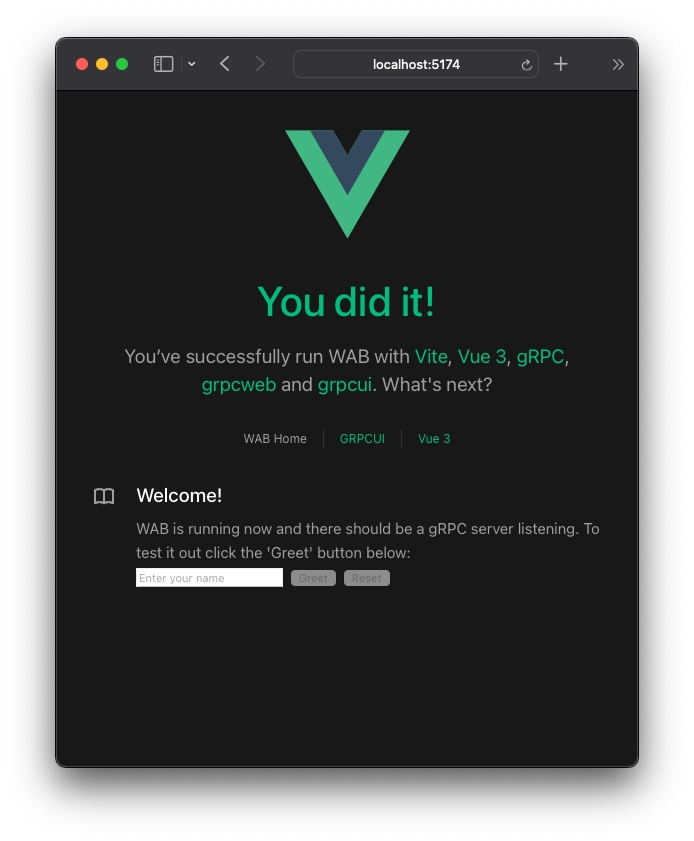
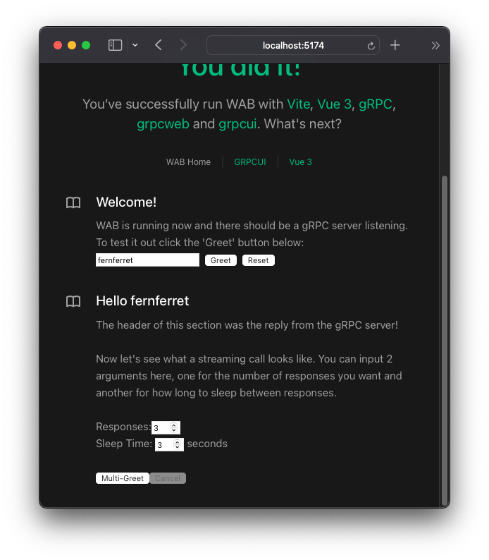
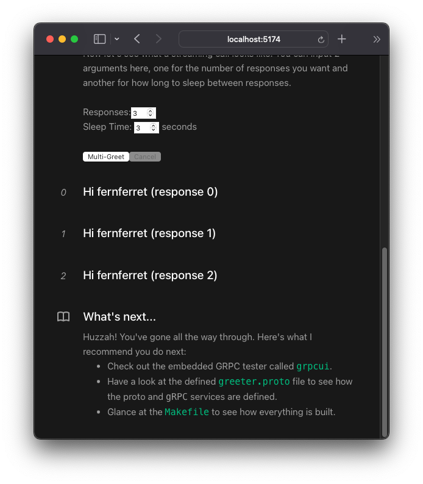
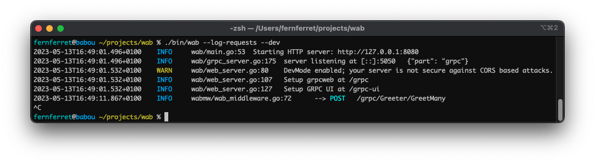
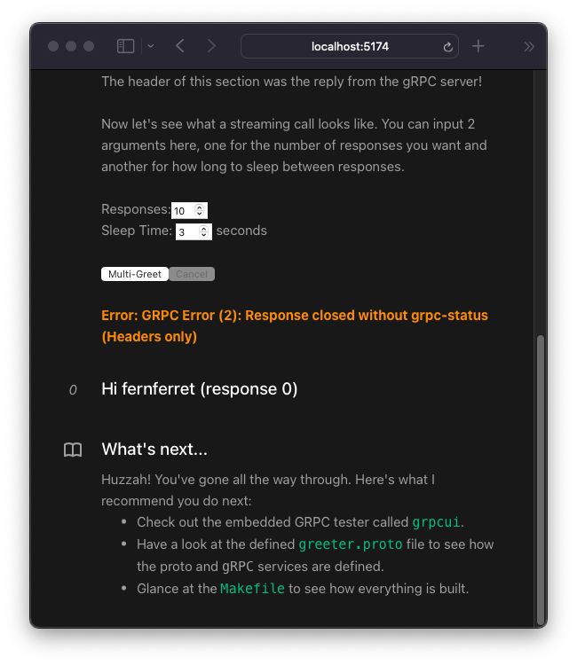
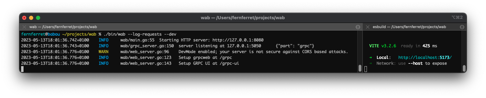
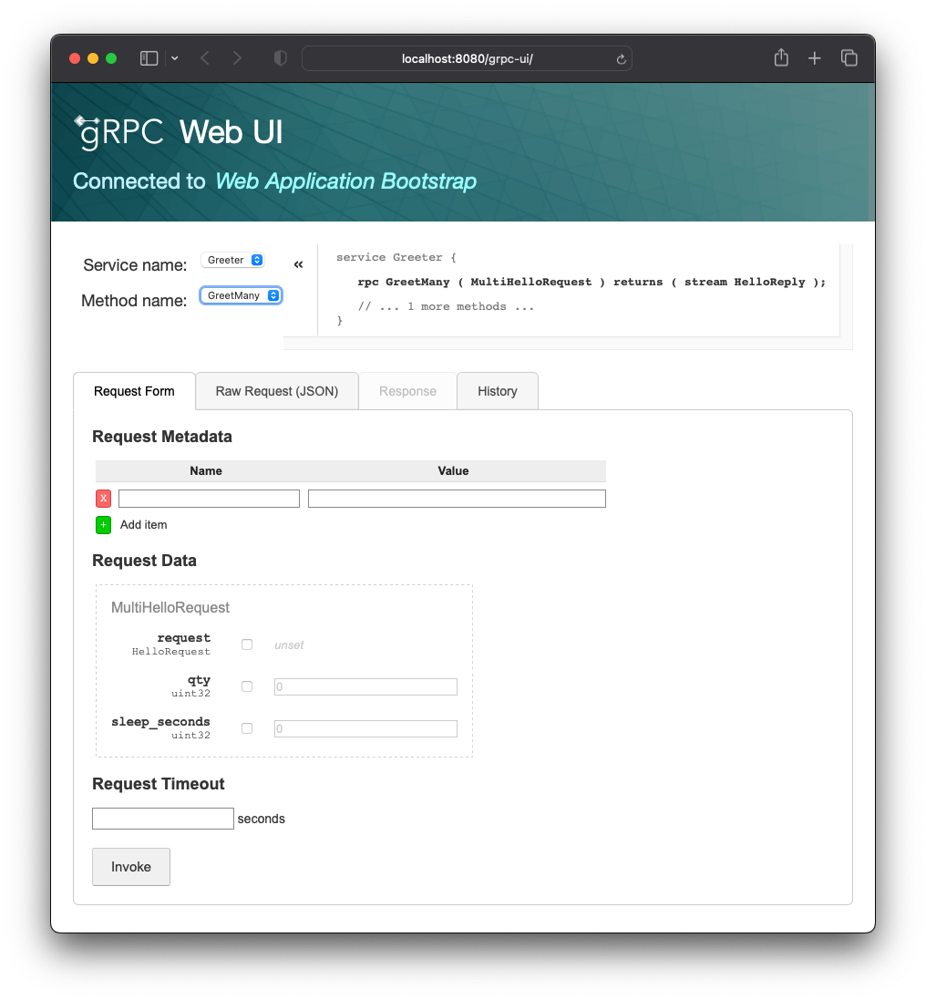

# About

The Web Application Boilerplate (WAB) is a template for how to build a small
self-contained application with an embedded user interface.

The goal of this project is to showcase how an application can be built without
any of the business logic. It can be used to trial new technology and ensure the
core functions (protobuf generation, HTTP/2, cancellations, etc) are all working
in a nice happy isolated environment.

It's a bit too complex to just be used as a template as it does come out of the
box with a sample application based on the [Vue 3
template](https://github.com/vuejs/create-vue)

## Quick Start

If you want to see WAB in action, just clone this repo, build with `make`, then
run:

```console
make
./bin/wab --log-requests
```

You should be able to open up a browser window to <http://127.0.0.1:8080> and
see the WAB UI.

If something isn't quite working, go check out the
[prerequisite](#prerequisites) section, this will show you how to install all
the development tools (nearly from scratch).

Once things are working, have a look at the various [exercises](#exercises).

## Prerequisites

WAB ships out of the box with [fully vendored
dependencies](https://go.dev/ref/mod#vendoring) so you should be able to get it
built without any external dependencies.

When you want to edit the protobuf files though, you'll need to make sure you
have a few more tools installed to recompile the proto files.

### Generic Dependencies

* `make` - You'll need a copy of `make` this is likely installed by your system.
* [`go`](https://go.dev/) - `go` 1.20+ is required to build the backend code.
  You could probably get away with an older version with some modifications.
* [`nodejs`](https://nodejs.org/en) - Needed to
  install/[transpile](https://en.wikipedia.org/wiki/Source-to-source_compiler)
  the [VueJS](https://vuejs.org/) UI

### Other Dependencies

This project uses protocol buffers (protobuf). These must be compiled from a
`.proto` file using the protoc compiler. If you want to change the `.proto`
files included under the `proto/` directory, you'll need the following.

* [protoc](https://grpc.io/docs/protoc-installation/) - I recommend installing
  via `brew` or your system's package manager.
* [protoc-gen-go,
  protoc-gen-go-grpc](https://grpc.io/docs/languages/go/quickstart/) - Used to
  generate gRPC bindings for go.  
  Install with:

  ```console
  go install google.golang.org/protobuf/cmd/protoc-gen-go@latest
  go install google.golang.org/grpc/cmd/protoc-gen-go-grpc@latest
  ```

* [protoc-gen-grpchan](https://github.com/fullstorydev/grpchan) - Used to
  generate binding for [in-memory gRPC
  channels](https://github.com/fernferret/wab/blob/0d7221099b97b6060a8641265120297f297df334/grpc_server.go#L114-L116),
  Install with:

  ```console
  go install github.com/fullstorydev/grpchan/cmd/protoc-gen-grpchan@latest
  ```

To setup your ui development area make sure you have a copy of

```console
go install github.com/fullstorydev/grpchan/cmd/protoc-gen-grpchan@latest
```

### Running gRPC backend

The `go` backend can contain the user [interface automatically
embedded](#running-with-embedded-ui) to produce a single, dependency-free build,
but for now and for development, it's very useful to see how to build them
separately.

```console
# Build an executable in ./bin/wab without the VueJS UI
make noui
```

Now you can just run it! I highly recommend enabling the `--log-requests` flag
which will print when a request comes in and the response that was sent to a
client.

You'll also want to enable `--dev` when running the user interface in dev mode.
This will add [CORS
headers](https://auth0.com/blog/cors-tutorial-a-guide-to-cross-origin-resource-sharing/)
to the routes so the web UI won't reject them.

```console
./bin/wab --log-requests --dev
2023-05-13T15:58:28.147+0100  INFO  wab/main.go:53  Starting HTTP server: http://127.0.0.1:8080
2023-05-13T15:58:28.147+0100  INFO  wab/grpc_server.go:175  server listening at [::]:5050  {"part": "grpc"}
2023-05-13T15:58:28.179+0100  WARN  wab/web_server.go:80  DevMode enabled; your server is not secure against CORS based attacks.
2023-05-13T15:58:28.179+0100  INFO  wab/web_server.go:107  Setup grpcweb at /grpc
2023-05-13T15:58:28.180+0100  INFO  wab/web_server.go:127  Setup GRPC UI at /grpc-ui
```

You should be able to open a web browser to <http://127.0.0.1:8080> and see the
following message:

```text
No UI embedded in this copy of wab
```

This is great! The reason this is desplayed is because when we ran our `make`
above, we ran `make noui` which did not embed the VueJS front-end app.

You should also be able to see the `grpcui` interface if you browse to
<http://127.0.0.1:8080/grpc-ui/>, but that is [covered later in the debugging
`gRPC` section](#debugging-grpc-with-grpcui).

Keep reading to see how to [build and run the UI](#running-the-vuejs-ui), then
building a [fully embedded application](#running-with-embedded-ui).

### Running the VueJS UI

The VueJS ui is pretty easy to build, and if you are familiar with `npm`
commands you're welcome to use those. For convenience I've provided `make`
targets for all operations so `make` can be the "one stop shop".

If you customized the address of your development backend to something other
than `http://127.0.0.1:8080` be sure to replace that in the export below. These
instructions use `bash` syntax.

Now build and run the UI in [HMR Development
mode](https://vitejs.dev/guide/api-hmr.html)[^1] using `make` as shown:

```bash
# Only required the first time and when npm packages change
make setupui

# Set the address of the go backend
export VITE_API_ADDR=http://127.0.0.1:8080

# Start the Vue development server
make dev-ui
```

Now you should be able to open a web browser to the address shown (likely
<http://localhost:5174/>) to see the following UI:



At this point, you can either skip to the [getting started with
WAB](#getting-started-with-wab) or continue to building the complete embedded
[backend/frontend embedded into one file](#running-with-embedded-ui).

### Running with Embedded UI

**NOTE:** This assumes you've already read the above sections and can build both
the backend/frontend:

* [Build the backend](#running-grpc-backend)
* [Build the frontend](#running-the-vuejs-ui)

Now with an additional `make` target, we can build an entirely embedded
application using `go`'s wonderful [embed
directive](https://blog.carlmjohnson.net/post/2021/how-to-use-go-embed/)[^2]

```console
make full
```

You should see the vite build scripts run, followed by the go build (although
this is very quiet).

Once it finishes you're left with a single executable in the `./bin` folder
called `./bin/wab`.

To run everything, you can simply run[^3]:

```console
./bin/wab --dev --log-requests
```

Great! Now regardless of which way you're running WAB let's move on to learning
a bit about how this is setup with [getting started with
WAB](#getting-started-with-wab).

## Technology

TODO

## Exercises

WAB is built to showcase how various pieces of technology fit together to build
an application, however it includes **a lot** of individual tech. If you'd like
to see a deep dive on the individual pieces of tech, have a look at the
[technology](#technology) section.

### Getting started with WAB

Welcome! If you're looking to get started, make sure you have a copy of WAB
running. This section assumes it's running [fully
embedded](#running-with-embedded-ui), but it should still make sense if you're
[running in split mode](#running-in-split-mode).

Start `wab` with the following command (if you haven't already):

```console
./bin/wab --log-requests
```

This will:

* Start an HTTP server on `127.0.0.1:8080` which will serve up
  * The compiled VueJS App. This is where your business logic would go
  * A [GRPC Debuggging User Interface](https://github.com/fullstorydev/grpcui)
    (totally separate from the Application)
  * An embedded copy of [grpcweb](https://github.com/improbable-eng/grpc-web)
    that the VueJS App will talk to (see below)
* Start a `gRPC` server on `127.0.0.1:5050`
  * This can be used by other gRPC clients or test software like
    [grpCURL](https://github.com/fullstorydev/grpcurl):

    ```console
    % grpcurl -plaintext localhost:5050 list
    Greeter
    grpc.reflection.v1alpha.ServerReflection
    % grpcurl -plaintext localhost:5050 list Greeter
    Greeter.Greet
    Greeter.GreetMany
    ```

See [configuring WAB](#configuring-wab) for more details on the options

**A quick note about `grpcweb`**

The embedded `grpcweb` server is really important for this demo. `gRPC` cannot
be natively run in the web due to some browser limitations. Here's a decent
write-up on it: <https://grpc.io/blog/grpc-web-ga/>. There are a few options you
have:

* Run a proxy like
  [envoy](https://grpc.io/docs/platforms/web/basics/#configure-the-envoy-proxy)
* Use a reverse proxy like
  [traefik](https://doc.traefik.io/traefik/master/middlewares/http/grpcweb/)
* Use an embedded grpc web proxy like
  [grpcweb](https://github.com/improbable-eng/grpc-web#grpc-web-typed-frontend-development)

To make WAB work "batteries included" I have opted to use the third option,
`grpcweb` which turns any HTTP request that is [sent to `/grpc/*` into a GRPC
call](https://github.com/fernferret/wab/blob/47ea650fee0e01c548736854f13919e8c925ac75/web_server.go#LL108C64-L108C75).

Ok, now that you have the UI up it should look like this:


To test things out, enter your name in the textbox and click *Greet*, you should
see the following response:



Cool, so what happened, well, When you clicked the `Greet` button, a GRPC call
was sent from the VueJS webui to the backend, and it returned the message `Hello
fernferret`. This is an example of a web based [`unary`
call](https://grpc.io/docs/what-is-grpc/core-concepts/#unary-rpc).

That's cool, but a lot of the time you'll want to stream responses to the
client, and this is where things get more interesting...

In the next block we're given 2 input boxes and a `Multi-Greet` button. These
let you play with what happens when you close a browser tab, or cancel a request
mid-run.

Go ahead and leave both text boxes at 3 and 3 and click `Multi-Greet`. In
roughly 9 seconds you should see this output:



Awesome, you should have seen these 3 responses come in 3 seconds apart from
each other. This shows the streaming request is working! Feel free to open up
your browser's Dev Tools and watch the requests as they go.

Before we wrap things up, let's see if something interesting happens if we stop
the server as it's serving a request. Set the inputs to 10, 3, respectively and
click `Multi-Greet` again.

Now, type `Ctrl + C` in the terminal where you're running WAB. Look at that, the
browser recognized that there was an error and displayed it!





This shows that just like with websockets, the browser and server can interact
with unexpected operations and inform users correctly. The Cancel button will do
the opposite and you can try it out too.

This is all the demo does. It'e intentionally bland so you can see how
interactions work and not focus on business logic.

Next, let's move on to a faster development loop by [running in split
mode](#running-in-split-mode).

### Running in Split Mode

The embedded UI is fantastic for distributing to other users, it makes it really
easy to run your app, however for development having to rebuild the javascript
and go code every time you want to tweak a color or a `<div>` attribute is very
slow.

To speed up our dev-loop we'll combine 2 techniques shown above to achieve a
very fast dev loop.

**NOTE:** You will need to use the `--dev` flag here, since we'll be running the
backend on port `8080` and the frontend on port `5173` (the vite default).

First, let's build the go code without an embedded ui. This means if you change
your go code, you can quickly rebuild it without having to rebuild the
javascript:

```console
make noui && ./bin/wab --dev --log-requests
```

The `noui` target will pass a golang buildtag `-tags noui` which will embed a
blank file instead of the full javascript. It will still continue to serve up
`gRPC` and `grpcweb` requests, so you can keep developing!

Now, in another hterminal, let's run the vite HMR development server. This spins
up a quick server that will immediately reflect changes you make to your
typescript/Vue files without any reload.

There is one extra step here though, since we've split the frontend from the
backend, the front-end does not know where to talk to the gRPC server.

I've plumbed this in as an environment variable named `VITE_API_ADDR`. So since
our backend is presumably running on `http://127.0.0.1:8080` we can just set the
`VITE_API_ADDR` env var before running the make target, like so:

```bash
export VITE_API_ADDR=http://127.0.0.1:8080
make dev-ui
```

Here's what this looks like, I usually split my terminal like so:



If I need to recompile the backend I can just press `Ctrl + C`, `Up Arrow` and
`Enter` and I'm recompiled and running again.

The main reason I don't use `go run ./cmd/wab` is because I find [attaching the
debugger](#debugging-with-vscode-and-dlv) is easier with an independent binary.

### Making changes to the `.proto` files

Making changes to a `.proto` file and having it re-generate all your languages
source code is one of the most satisfying things ever.

Let's say you wanted to modify the proto file and then re-build the interfaces,
great!

1. Make sure you have all of the [prereqs](#prerequisites) met including the
   [generic](#generic-dependencies) and [others](#other-dependencies)
2. Modify the [proto
   file](https://github.com/fernferret/wab/blob/0d7221099b97b6060a8641265120297f297df334/proto/greeter.proto)
   to your liking
3. Run `make proto`

That's it!. Feel free to have a look at the
[`Makefile`](https://github.com/fernferret/wab/blob/0d7221099b97b6060a8641265120297f297df334/Makefile#L29-L40)
for more details.

How proto compiling works in general is that `protoc` will do the heavy lifting,
then other folks will write plugins like `protoc-gen-go`. `protoc` will
autodiscover the plugins by their name if they're passed as a command line
option, like `--go_opt`. For example, the `--go-grpc_opt` flag will look for a
`protoc-gen-go-grpc` binary.

If you'd like more information on `protoc` or it's plugins, have a look at
these:

* <https://github.com/protocolbuffers/protobuf/blob/main/docs/third_party.md>

I should note that I'm using [buf](https://github.com/bufbuild/buf) in other
projects and I really like it! I just wanted to keep things a bit simpler so you
can understand the ecosystem around `protoc` and how plugins work before diving
into an abstraction layer like `buf`.

### Debugging with VSCode and `dlv`

WAB ships with 2 built-in debugging profiles for
[VSCode](https://code.visualstudio.com/).

You'll need the [go plugin](https://code.visualstudio.com/docs/languages/go)
installed. Go do that and come back here.

1. Run WAB via `./bin/wab ...`
2. Place some breakpoints where you want to do some debugging.
3. Switch to the debugging view and run the `Attach to Process` configuration
4. Select `wab` from the list.
5. Make a call via the WAB UI, `grpcui` or `gRPCurl`
6. Watch as dlv does all the hard work and your code pauses on the breakpoint

### Debugging gRPC with GRPCUI

[`gRPCurl`](https://github.com/fullstorydev/grpcurl) is a great tool to debug
`gRPC` calls but what if there was a full UI to do that too?

Spoiler alert: The `gRPCurl` devs wrote one of those too, it's called
[`grpcui`](https://github.com/fullstorydev/grpcui).

It comes embedded at <http://127.0.0.1:8080/grpc-ui/> (note the trailing slash)
and looks like this:



You can use it by just typing in the values you want and clicking `Invoke`. It
will run even with `--no-grpc` as it operates on an [in-memory `gRPC`
channel](https://github.com/fernferret/wab/blob/0d7221099b97b6060a8641265120297f297df334/grpc_server.go#L114-L116),
which is super great for testing and plumbing a UI like this.

The grpcui [embeds the `greeter.proto` file within the
binary](https://github.com/fernferret/wab/blob/0d7221099b97b6060a8641265120297f297df334/proto/proto.go#L11),
so whenever you change the proto file and run `make proto` the UI will
automatically have the latest spec. This is done so it doesn't have to use the
[reflection
api](https://github.com/grpc/grpc-go/blob/master/Documentation/server-reflection-tutorial.md#enable-server-reflection)
(which it can). I just like the idea that it can be run with a built copy of the
code and just include everything that it should.

I think the `grpcui` is probably my favorite way of testing and debugging `gRPC`
services right now so give it a try! You can also run it [**non-embedded** as an
executable that uses the reflection
api](https://github.com/fullstorydev/grpcui#installation).

### Configuring WAB

WAB has a ton of options to showcase how various things work, let's take a look
at some common options and configurations.

You can also have a look at the source or run with `--help` to get more info.

#### HTTP or gRPC?

By default, WAB opens 2 ports, `8080` and `5050`. The `8080` port is an
[echo](https://github.com/labstack/echo) webserver that also routes the
[grpcui](https://github.com/fullstorydev/grpcui#grpc-ui) debugging tool and
[grpcweb](https://github.com/improbable-eng/grpc-web#grpc-web-typed-frontend-development)
proxy.

The `5050` port is the native gRPC port which can be used by external tools like
[`gRPCurl`](https://github.com/grpc/grpc-go/blob/master/Documentation/server-reflection-tutorial.md#list-services-and-methods)

##### HTTP Port

The HTTP port cannot be disabled. You could theoretically do that, but the name
of this project is the *web* application bootstrap!

By default there are 3 items exposed on it:

* `/grpc/*` -
  [`grpcweb`](https://github.com/improbable-eng/grpc-web#grpc-web-typed-frontend-development)
  traffic. This is what the VueJS app uses to talk to the backend.
* `/grpc-ui/*` - [`grpcui`](https://github.com/fullstorydev/grpcui) A fully
  embedded copy of the `grpcui` that can be used to debug your `gRPC` app.
* `/*` - Anywhere else routes to the VueJS application. THere are some
  sub-divisions for `/static/*` and `/assets/*` that ensure that these contents
  are always served up, but for most purposes anything else just gets sent to
  the Vue app. This is so Vue can perform the routing it wants as a
  [SPA](https://en.wikipedia.org/wiki/Single-page_application).

```console
wab --help
usage: ./bin/wab
  -b, --bind string        set the bind host for the http server (default "127.0.0.1:8080")
...
      --dev                if true, CORS headers will be insecure, use if you're splitting the API/Server for now.
      --log-requests       if true, http requests will be logged, pretty loud
      --no-grpcui          disable the GRPCUI debug endpoint at /grpc-ui/
      --no-grpcweb         disable the grpcweb endpoint at /grpc/, this means the embedded Vue app won't work
...
```

The `-b`/`--bind` flag will allow you to change what interface the `HTTP` server
binds to, in case you had multiple NICs or wanted to use a different port.

The `--dev` flag enables
[CORS](https://auth0.com/blog/cors-tutorial-a-guide-to-cross-origin-resource-sharing/)
headers so the UI can be [split from the backend](#running-in-split-mode). It is
not needed if you're running in embedded mode. In production you should handle
CORS headers [with your revers
proxy](https://doc.traefik.io/traefik/middlewares/http/headers/#cors-headers).

The `--log-requests` flag logs every http request. It's really nice for
debugging what's going on with reverse-proxy routing issues. It currently only
affects `HTTP` traffic and not `gRPC` traffic.

TODO: Implement a flag for `gRPC` based logging via an Interceptor.

The `--no-grpcui` and `--no-grpcweb` flags disable each of these features. This
can be useful to see how to do, as you'll likely want to disable `grpcui` in
production and might want to disable `grpcweb` if you're using something like
[envoy](https://grpc.io/docs/platforms/web/basics/#configure-the-envoy-proxy) as
a proxy

##### gRPC Port

There are a few config options for the `gRPC` port:

```console
wab --help
usage: ./bin/wab
...
  -g, --bind-grpc string   set the bind address for the gRPC server (default "127.0.0.1:5050")
      --no-grpc            disable the native gRPC binding, grpcweb will still be available
      --no-reflection      disable gRPC reflection, this will prevent gRPCurl from working
...
```

The `-g`/`--bind-grpc` flag will allow you to change what interface the `gRPC`
server binds to, in case you had multiple NICs or wanted to use a different
port.

The `--no-grpc` flag disables binding to the `gRPC` port altogether. If set, the
`grpcweb` proxy will still work, so the demo VueJS app will totally still work,
but other connections and tools, like `gRPCurl` will not.

[^1]: Hot Module Replacement, or HMR, will allow you to change files and have
    them automatically reloaded in your browser. This makes it much easier to
    develop web applications. Vue 3 now uses
    [Vite](https://vitejs.dev/guide/api-hmr.html) to perform this function,
    there's no configuration that you need to do when running in development
    mode.

[^2]: There are lots of great articles that cover how to do go embedding the
    this one by Carl is one of my favorites as he goes over both embedding
    directories and individual files. Both techniques are used in WAB: [ui as a
    directory](https://github.com/fernferret/wab/blob/0d7221099b97b6060a8641265120297f297df334/ui/ui.go)
    and [proto file as a
    string](https://github.com/fernferret/wab/blob/0d7221099b97b6060a8641265120297f297df334/proto/proto.go#L11).

[^3]: Note that we pass the `--dev` and `--log-requests` directives here to see
    what's going on. This was first shown in [running the grpc
    backend](#running-grpc-backend).
